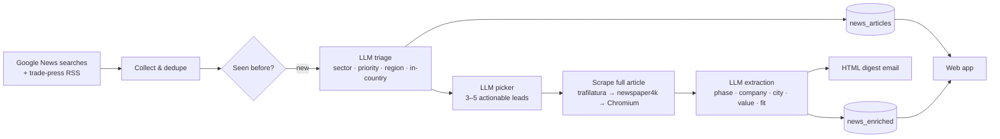

# 📡 LeadRadar

**AI-powered B2B lead discovery — turns the daily news into qualified, enriched sales leads.**

Every morning LeadRadar scans hundreds of local-language news articles per country, uses an LLM to spot
projects that will need *your* products **before** the work starts, scrapes the full article for the
details a sales rep actually needs (project phase, company, city, budget), and delivers a short digest of
the 3–5 best leads to the sales team. A companion web app lets the team triage, group, assign, qualify,
discuss, and research every lead — including finding decision-maker contacts.

It is **industry-agnostic**: what counts as a good lead is defined in one [business profile](#business-profile)
file. The repository ships with a fictional equipment-rental company as the example.

> Originally built as an internal production tool. This repository is a sanitized, generalized version —
> every company-specific name, dataset, credential, and infrastructure identifier has been removed.

---

## Highlights

- **End-to-end pipeline** — collect → triage → pick → scrape → extract → compose → send → persist, one country per run.
- **Industry-agnostic by design** — every LLM prompt is assembled from a TOML business profile (products, sectors, priority rules, relevance criteria). Switch industries without touching code.
- **Multilingual** — local-language searches per country, sales text written in the country's language, and a closed per-country vocabulary of administrative regions.
- **Robust scraping** — Google News redirect decoding, trafilatura → newspaper4k → headless Chromium fallback chain, and JS-wall detection.
- **Hallucination guards** — grounded extraction, one LLM call per article, URL-primary resolution of LLM picks, closed vocabularies with fuzzy normalization, and tags re-derived (not copied) at every stage.
- **Team web app** — FastAPI + HTMX: filters, on-demand AI enrichment, duplicate-story grouping, assignment with email notifications, qualification, @mentions, share-by-email, an AI chat assistant per lead, and contact discovery.
- **Contact finder** — a standalone package that resolves a company name to its domain (two independent resolvers + LLM arbitration) and finds decision-makers via the Clay API.
- **Production concerns** — Prefect orchestration, Docker image, Azure Container Apps deployment script, pluggable mail backends, fire-and-forget persistence, and two LLM providers (Azure OpenAI or Mistral).

## How it works



| Stage | Module | What happens |
|---|---|---|
| 1. Collect | `pipeline/news_sources.py` | Builds a search plan (generic project themes + local-language themes + profile extras) and trade-press feeds for one country; dedupes by URL. |
| 2. Triage | `pipeline/opportunity_triage.py` | One LLM call tags **every** new article with priority, sector, region, and an in-country verdict. Foreign news is dropped; "unclear" is demoted, never dropped. |
| 3. Pick | `pipeline/opportunity_picker.py` | The LLM selects 3–5 leads that pass three hard requirements — relevance, timing (not yet under construction), location — ranked by the profile's quality signals. |
| 4. Enrich | `pipeline/article_scraper.py`, `opportunity_enricher.py` | Scrapes each pick and extracts structured fields in a separate, grounded LLM call per article. |
| 5. Compose | `pipeline/digest_composer.py` | Deterministic HTML email (no LLM), phase-colour-coded cards, everything HTML-escaped. |
| 6. Send | `core/mailer.py` | `file` (default), `smtp`, or Microsoft Graph backend. |
| 7. Persist | `pipeline/lead_pipeline.py` | Articles and leads land in SQL Server for the web app — fire-and-forget, so a DB outage never blocks the email. |

## Design decisions

A few non-obvious choices, each made after the simpler approach failed in practice:

- **Decode Google News redirects before fetching.** A raw `news.google.com/rss/articles/...` link often returns Google's GDPR consent page with **HTTP 200** — it looks like success. Links are decoded to the publisher URL first, with retries for Google's rate limiting.
- **Detect JavaScript walls on the *extracted* text, not the raw HTML.** Plenty of normal pages carry a `<noscript>` "please enable JavaScript" tag for analytics; matching raw HTML produced false positives. Only a *short* extraction dominated by that phrase triggers the headless-browser fallback.
- **Trust the URL, not the index.** LLMs occasionally mis-number items in long lists. Every pick/triage entry echoes both the index and the URL; the URL wins, the index is a fallback, and mismatches are logged to monitor reliability.
- **One extraction call per article.** Batching several articles into one prompt led to companies and cities bleeding between articles. At 3–5 leads a day the extra calls are negligible.
- **Re-derive tags at every stage.** Triage, picker, and enricher all receive the *full* classification rubric and are told to reach their own conclusion — telling a stage to "re-check" without the criteria just makes it copy the previous answer.
- **Always include the RSS summary** next to the scraped text: summaries sometimes state a figure more crisply than the body.
- **Closed vocabularies + normalization.** Regions and sectors must come from fixed lists; LLM output is normalized with `unidecode`, explicit local-language aliases (e.g. *Vlaanderen* → Flanders), and a strict fuzzy match — anything else becomes `NULL` rather than polluting filters.
- **Timing is the whole game.** Completed projects are discarded, and so are projects already under construction — *unless* the article describes a new, additional need (a scope increase, a new contractor joining).
- **No LLM in the email layout.** Leads are structured data by the time they reach the composer, so a plain template guarantees a correct layout every time.

## Business profile

Everything industry-specific lives in `profiles/*.toml` — the code contains no product or industry knowledge.

```toml
[company]
name     = "Acme Equipment Rental"
tagline  = "construction and industrial equipment rental"
products = ["earthmoving equipment", "aerial work platforms", "generators and temporary power", ...]

[lead]
fit_label      = "Equipment need"                       # label on lead cards
fit_definition = "why this project plausibly needs to rent equipment from us"
relevance      = "the project plausibly creates demand for rented construction or industrial equipment: ..."
quality_signals = ["Scale: ...", "Duration: ...", ...]

[priority]
high   = "large-scale projects with a long, multi-category equipment need ..."
medium = "standard building-construction projects run by a general contractor ..."
low    = "small or short jobs ..."

[[sectors]]
name          = "Energy & Utilities"
description   = "wind and solar farms, grid works, ..."
higher_margin = true

[search]
extra_themes_en = ["earthworks+civil+engineering+contract"]
[search.extra_local_themes]
es = ["movimiento+de+tierras+licitación"]

[[team]]                                                # web-app assignment / @mentions
name  = "Jane Cooper"
email = "jane.cooper@example.com"
```

Point `BUSINESS_PROFILE` at a different file to hunt leads for a solar installer, a catering company, a
security firm… The test suite includes a check that switching profiles changes every prompt.

## Project structure

```
leadradar/
├── main.py                     # CLI: python main.py [COUNTRY ...]
├── core/                       # infrastructure — no lead-finding logic
│   ├── config.py               #   AppConfig (frozen, read from .env)
│   ├── business_profile.py     #   loads the TOML profile every prompt is built from
│   ├── llm_client.py           #   Azure OpenAI / Mistral through the OpenAI SDK
│   ├── feed_reader.py          #   RSS / Atom → NewsItem
│   ├── mailer.py               #   file / SMTP / Microsoft Graph backends
│   ├── news_models.py          #   NewsItem, EnrichedOpportunity
│   └── sql_connector.py        #   SQL Server / Azure SQL
├── pipeline/                   # the lead-finding pipeline
│   ├── country_config.py       #   countries, regions, output languages
│   ├── news_sources.py         #   search plan + trade-press feeds
│   ├── opportunity_triage.py   #   stage 2 — tag every article
│   ├── opportunity_picker.py   #   stage 3 — pick 3–5 actionable leads
│   ├── article_scraper.py      #   full-text scraping with fallbacks
│   ├── opportunity_enricher.py #   stage 4 — grounded structured extraction
│   ├── digest_composer.py      #   stage 5 — deterministic HTML email
│   └── lead_pipeline.py        #   orchestrator
├── webapp/                     # FastAPI + HTMX + Tailwind team app
├── clay_contact_finder/        # standalone package: company → domain → contacts
├── profiles/                   # business profiles (TOML)
├── flows/                      # Prefect flow + deployment
├── sql/schema.sql              # database schema
├── infra/deploy.ps1            # Azure Container Apps deployment
├── scripts/demo_digest.py      # render a sample digest offline
└── tests/                      # offline unit tests
```

## Getting started

**Prerequisites:** Python 3.11+, [uv](https://docs.astral.sh/uv/), SQL Server or Azure SQL with
[ODBC Driver 18](https://learn.microsoft.com/sql/connect/odbc/download-odbc-driver-for-sql-server),
and an Azure OpenAI or Mistral API key.

```bash
git clone https://github.com/<you>/leadradar.git
cd leadradar
uv sync
uv run playwright install chromium     # headless browser for JS-heavy sites
cp .env.example .env                   # then fill in the LLM + database sections
```

**Preview the email without any setup:**

```bash
uv run python scripts/demo_digest.py   # writes a sample digest to ./outbox/
```

**Database** — any SQL Server works, e.g. a local container:

```bash
docker run -e "ACCEPT_EULA=Y" -e "MSSQL_SA_PASSWORD=<StrongPassword>" -p 1433:1433 -d mcr.microsoft.com/mssql/server:2022-latest
sqlcmd -S localhost -U sa -P "<StrongPassword>" -C -Q "CREATE DATABASE leadradar"
sqlcmd -S localhost -U sa -P "<StrongPassword>" -C -d leadradar -i sql/schema.sql
```

**Run:**

```bash
uv run python main.py SPAIN                           # one country; digest → ./outbox/ by default
uv run python main.py                                 # every enabled country
uv run uvicorn webapp.app:app --reload --port 8000    # web app → http://localhost:8000
```

## Configuration

All settings come from environment variables / `.env` — see [`.env.example`](.env.example) for the full list.

| Setting | Purpose |
|---|---|
| `BUSINESS_PROFILE` | Which profile the prompts are built from |
| `ENABLED_COUNTRIES` | Countries run when no country is passed on the command line |
| `LLM_PROVIDER`, `AZURE_*`, `MISTRAL_*` | LLM backend and model / deployment names |
| `AZURE_SQL_*` | Database connection |
| `MAIL_BACKEND`, `SMTP_*`, `GRAPH_*`, `EMAIL_*` | Email delivery; `RECIPIENTS_<COUNTRY>` / `CC_<COUNTRY>` override per country |
| `AAD_*`, `SESSION_SECRET_KEY` | Optional Microsoft Entra ID sign-in for the web app (open when unset) |
| `CLAY_*`, `SERPER_API_KEY` | Optional contact finder (disabled when unset) |

**Adding a country:** add an entry to `pipeline/country_config.py` (name, ISO code, regions, city hints,
output language) and, optionally, local-language themes and trade-press feeds to `pipeline/news_sources.py`.

## Scheduling & deployment

- **Cron / Task Scheduler:** run `python main.py` daily; it exits non-zero if any country failed and emails an error alert.
- **Prefect:** `flows/leadradar_flow.py` wraps each stage as a task with retries and run history; `flows/deploy.py` registers a weekday schedule (`LEADRADAR_CRON`, `LEADRADAR_TZ`).
- **Docker:** `docker build -t leadradar .` — the image runs the web app by default and the pipeline with `docker run --env-file .env leadradar python main.py`.
- **Azure Container Apps:** `infra/deploy.ps1` builds the image in ACR, pushes secrets from `.env`, and rolls out a new revision.

## Tests

```bash
uv run pytest
```

Offline unit tests — no API keys, network, or database: business-profile loading and prompt generation,
vocabulary normalization of LLM output, pick resolution, the actionability rule, search-plan building,
email composition (including HTML escaping), and the mail backends.

## Tech stack

Python 3.11+ · OpenAI SDK (Azure OpenAI / Mistral) · FastAPI · HTMX · Tailwind CSS · Jinja2 ·
SQL Server / Azure SQL (pyodbc, SQLAlchemy, pandas) · trafilatura · newspaper4k · Playwright · feedparser ·
Prefect · Docker · Azure Container Apps · MSAL (Entra ID) · Clay API · Serper

## Notes

- LLM output can be wrong: every digest says "verify details before commercial outreach", and the web app keeps the source article one click away.
- Scraping is deliberately low-volume (3–5 full articles per country per day); respect each site's terms of use.

---

**Author:** Taha Alami
